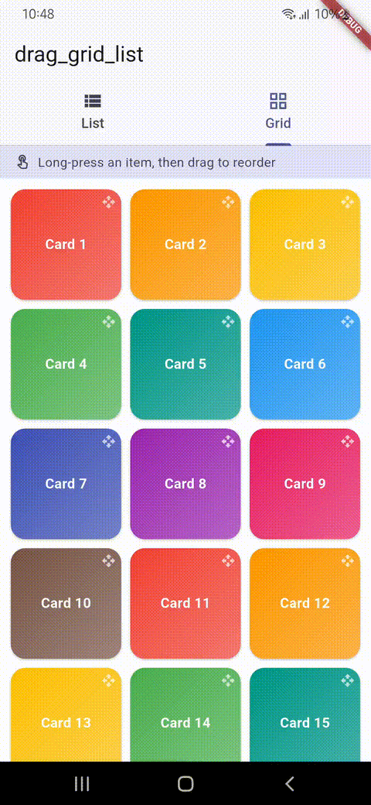
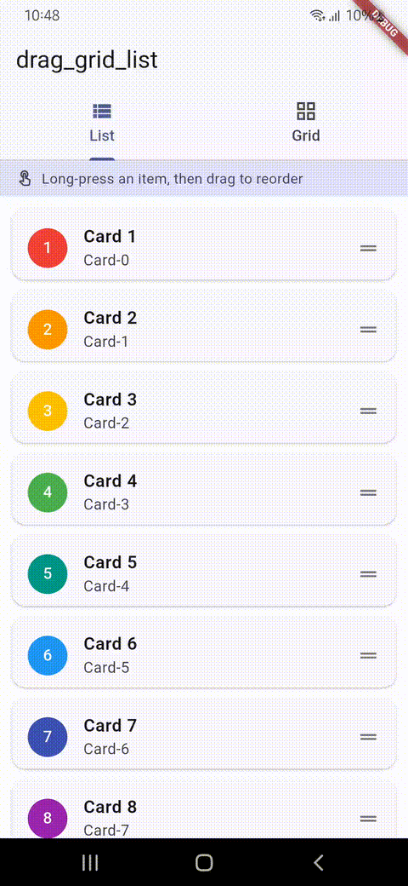

[](https://www.dashstack.tech/)

# drag_grid_list

Reorderable list + responsive grid, drag & drop, reordering, and cross-group
move — one widget, no external dependencies. Long-press drag on mobile,
mouse drag on desktop/web (auto-detected, fully overridable). No layout math
required from the consumer.

Requires Flutter >= 1.17, Dart >= 3.13.

## Demo

| List | Grid |
| --- | --- |
|  |  |

## Install

```yaml
dependencies:
  drag_grid_list: <latest_version>
```

```
flutter pub get
```

## Quick start — list

```dart
import 'package:drag_grid_list/drag_grid_list.dart';

DragGridList<Task>.builder(
  items: tasks,
  keyOf: (task) => ValueKey(task.id), // strongly recommended
  itemBuilder: (context, task, index) => TaskCard(task),
  onReorder: (oldIndex, newIndex) {
    setState(() {
      tasks = DragController.applyReorder(
        items: tasks,
        oldIndex: oldIndex,
        newIndex: newIndex,
      );
    });
  },
)
```

> **`onItemsChanged` is simpler still** — same event, but the reorder is
> already applied for you:
> `onItemsChanged: (updated) => setState(() => tasks = updated)`.

## Quick start — grid

```dart
DragGridList<Photo>.builder(
  items: photos,
  keyOf: (photo) => ValueKey(photo.id),
  layout: DragListLayout.grid,
  minColumnWidth: 140,   // auto column count, or supply `breakpoints:`
  minColumns: 2,
  maxColumns: 8,
  childAspectRatio: 1,
  itemBuilder: (context, photo, index) => PhotoTile(photo),
  onReorder: (oldIndex, newIndex) => ...,
)
```

Grid mode picks a column count from the viewport width every layout pass —
either an auto-fit derived from `minColumnWidth` (clamped to
`minColumns`/`maxColumns`), or explicit tiers via `breakpoints:`.

## All features

| Feature | How |
| --- | --- |
| List *or* grid, same widget | `layout: DragListLayout.list` / `.grid` |
| Responsive grid columns | `minColumnWidth` auto-fit, or explicit `GridBreakpoints` |
| Cross-group drag (kanban) | `DragGroupScope` + `groupId` / `acceptGroups` |
| Drag gesture per platform | auto-detected, override via `enableLongPressDrag` / `enableMouseDrag` |
| Custom drag preview / placeholder | `dragPreviewBuilder` / `dragPlaceholderBuilder` |
| Loading / empty states | `isLoading` + `loadingBuilder` / `emptyBuilder` (empty state stays a valid drop target) |
| Large datasets | builder-based, lazy `ListView.builder`/`GridView.builder` |
| Auto-scroll while dragging | `autoScrollEdgeSize` / `autoScrollMaxVelocity` |

## `GridBreakpoints`

```dart
const GridBreakpoints({
  this.mobileMaxWidth = 600,
  this.tabletMaxWidth = 1024,
  this.desktopMaxWidth = 1440,
  this.mobileColumns = 2,
  this.tabletColumns = 4,
  this.desktopColumns = 6,
  this.webColumns = 8,
});
```

`< mobileMaxWidth` uses `mobileColumns`, `< tabletMaxWidth` uses
`tabletColumns`, `< desktopMaxWidth` uses `desktopColumns`, everything else
uses `webColumns`. Pass a `GridBreakpoints` instance to `breakpoints:`
instead of `minColumnWidth` for explicit tier control.

## Cross-group drag (kanban-style)

Wrap sibling `DragGridList`s in `DragGroupScope` so they share one drag
session. Each list declares its own `groupId` and which groups it accepts
drops from:

```dart
DragGroupScope(
  children: [
    DragGridList<Task>.builder(
      items: todo,
      groupId: 'todo',
      acceptGroups: {'todo', 'doing', 'done'},
      itemBuilder: (context, task, index) => TaskCard(task),
      onReorder: (oldIndex, newIndex) => ...,
      onMove: (task, fromGroupId, toGroupId, toIndex) {
        setState(() {
          DragController.applyMove(
            source: listFor(fromGroupId),
            target: listFor(toGroupId),
            sourceIndex: listFor(fromGroupId).indexOf(task),
            targetIndex: toIndex,
          );
        });
      },
    ),
    DragGridList<Task>.builder(groupId: 'doing', acceptGroups: {...}, ...),
    DragGridList<Task>.builder(groupId: 'done', acceptGroups: {...}, ...),
  ],
)
```

A list with a single `groupId` and default `acceptGroups` (which defaults
to `{groupId}`) behaves as a plain, self-contained reorderable list/grid —
`DragGroupScope` is opt-in.

## Callbacks

| Callback | Fires | Signature |
| --- | --- | --- |
| `onDragStart` | drag gesture recognized | `(T item, int index)` |
| `onDragEnd` | drag gesture ends, success or not | `(T item, int index)` |
| `onReorder` | same-list position change | `(int oldIndex, int newIndex)` |
| `onItemsChanged` | same-list position change, reorder already applied | `(List<T> updated)` |
| `onMove` | cross-group move | `(T item, String fromGroupId, String toGroupId, int toIndex)` |
| `onDrop` | any successful drop resolves (reorder or move) — single funnel point for persistence | `(T item, String targetGroupId, int targetIndex)` |

An invalid drop (outside any drop target, or a target whose `acceptGroups`
doesn't include the source's `groupId`) snaps back with no callback except
`onDragEnd`.

The package never mutates your list — it only reports intent. Use
`DragController.applyReorder` / `DragController.applyMove` (or your own
logic, or just `onItemsChanged`) inside the callbacks to update state.

## Platform drag mode

| Platform | Default gesture |
| --- | --- |
| iOS / Android | long-press then drag |
| macOS / Linux / Windows | mouse-down then drag (no delay) |
| Web (`kIsWeb`) | mouse-down then drag (no delay) |

Override per list with `enableLongPressDrag` / `enableMouseDrag` (both
`bool?`, `null` = auto-detect).

## Customizing preview & placeholder

```dart
DragGridList<Task>.builder(
  ...
  dragPreviewBuilder: (context, task) => MyDragPreview(task),
  dragPlaceholderBuilder: (context, task) => MyPlaceholder(task),
)
```

Defaults: an elevated, slightly scaled copy of the item (preview) and a
dashed, dimmed box the same size as the item (placeholder) — avoids layout
jump while dragging.

## Example app

See `example/` for a runnable app with list and grid tabs, backed by demo
data (`example/lib/main.dart`, `example/lib/demo_data.dart`).

## Non-goals (v1)

- No masonry/staggered grid — fixed aspect-ratio cells only.
- No persistence/state management — the package only reports intent via
  callbacks; you own the source-of-truth list mutation.

## Bugs & Credits
Report bugs and ask questions on [GitHub Issues](https://github.com/Androidsignal/drag_grid_list/issues).
Maintained by [Dashstack Infotech, Surat](https://www.dashstack.tech/).
